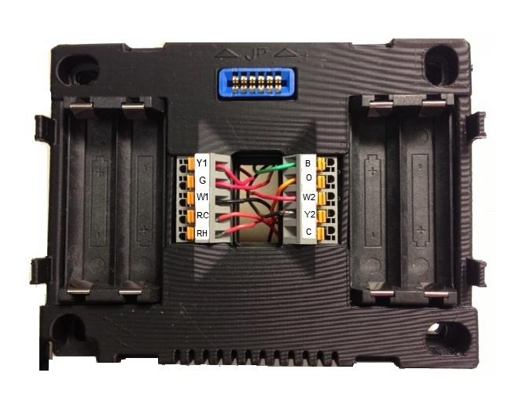
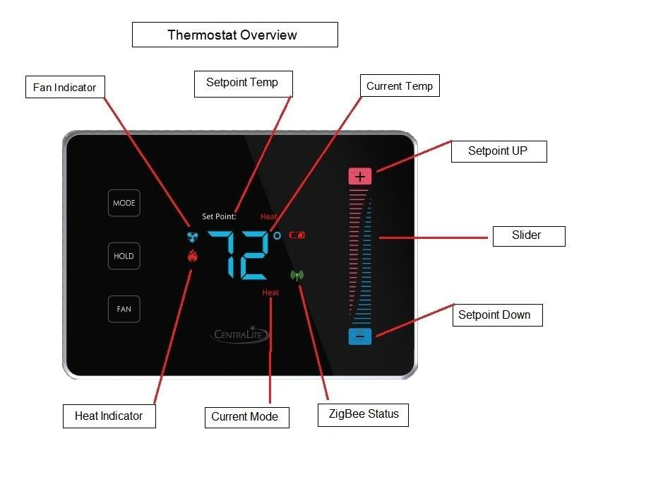
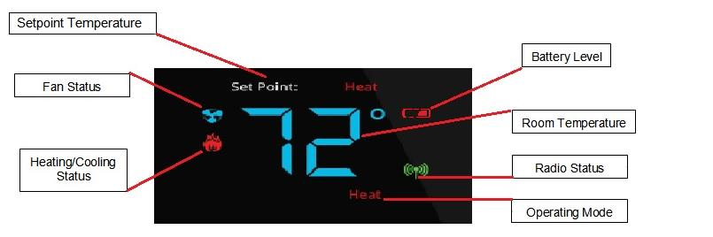
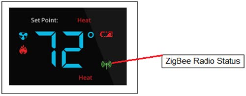

# Thermostat-Centralite-Zigbee-Manual

Installation guide for the Centralite 3157100 thermostat, covering setup, wiring, configuration, and ZigBee network connection. Includes step-by-step instructions, menu functions, best practices, and troubleshooting tips for technicians and DIY users.

# CENTRALITE 3157100 INSTALLATION MANUAL

## Table of Contents

- [Locating the Thermostat](#locating-the-thermostat)
- [Remove Existing Unit](#remove-existing-unit)
- [Installing The Thermostat](#installing-the-thermostat)
  - [Wiring Terminal Definitions](#wiring-terminal-definitions)
  - [Figure-1: Full Terminal View](#figure-1-full-terminal-view)
  - [Figure-2: Thermostat Overview](#figure-2-thermostat-overview)
  - [Figure-3: Thermostat Operation](#figure-3-thermostat-operation)
  - [Figure-4: Thermostat Functions](#figure-4-thermostat-functions)
- [Appendix-A](#appendix-a)
  - [Technical Support & Installation](#technical-support--installation)
  - [Programming Mode Menu Functions](#programming-mode-menu-functions)
  - [Menu Options](#menu-options)
- [Appendix-B](#appendix-b)
    - [Battery Installation and Replacement](#battery-installation-and-replacement)

## Locating the Thermostat
If this is to replace an existing thermostat, just use the existing thermostat location.

If this is a new install, follow these suggestions:

- Locate the thermostat about 5 ft. above the floor away from direct sunlight, lamps, radios, televisions, fireplaces, hot water pipes, or other heating or cooling sources.
- Do not locate the thermostat near doors to the outside or windows.
- Do not locate the thermostat in a damp area.
- Do not locate the thermostat in an area that lacks air circulation.

## Remove Existing Unit
- Switch OFF the electricity to the HVAC unit.
- Remove the cover to the existing thermostat.
- Make a note of the terminal location for each wire connected to the thermostat wiring terminals (use enclosed labels to label wires). Wire colors are not standard, so it is important to note the terminal label each wire is connected to on the existing thermostat.
- While removing each wire from the existing thermostat wiring terminal, make sure to secure the wire so that it does not fall back into the wall.
- Once all wires are removed from the existing thermostat wiring terminal, remove the existing thermostat from the wall.
- Make sure to leave at least 3” of wire for each connection onto the CentraLite thermostat wiring terminal.
- Remove 1/8” insulation from the end of each wire.

## Installing The Thermostat

- If removing another thermostat, please use the enclosed labels to label the wires from your old device.
- Place each wire in the appropriate wire terminal. The wiring terminal is labeled as follows:

| Left |Right |
|-|-|
| Y1 | B  |
| G  | O  |
| W1 | W2 |
| RC | Y2 |
| RH | C  |

### Wiring Terminal Definitions

| Terminal | Description |
|----------|-------------|
| Y1       | Cool Control / Compressor |
| G        | Fan                      |
| W1       | Heat Control             |
| RC       | Power From Cooling       |
| RH       | Power From Heating       |
| B        | Heat Pump changeover (powered in heat mode) |
| O        | Heat pump changeover (powered in cool mode) |
| W2       | 2nd stage HEAT or Heat Pump auxiliary heat |
| Y2       | 2nd Stage Cool Control   |
| C        | Common                   |

**See Figure-1 "Full Terminal View"**

A thermostat that shows “E0” is a thermostat that has not yet been connected to a "valid" system or one that has not yet been "programmed." This "E0" is an indicator that the thermostat is in a factory default state. This "EO" status can be changed to a valid status by either programming the thermostat or by hooking up the thermostat to a valid system. (See [Appendix-A](#appendix-a) for programming menu options)

By default, the CentraLite thermostat comes with a wire jumper connecting the RH and RC power terminals. On most units, only one power source is used and can be connected to both RH and RC. But if you have another type of HVAC system, it may require separate power sources for heating and cooling. In this case, you will remove the jumper and separately power RC and RH. (See [Figure-1](#figure-1))

The CentraLite thermostat can be powered by 4 AA batteries or by the power from the 24V off the HVAC unit if a common wire is available. Even if you use the common wire for power, you should still install 4 AA batteries as a backup for the thermostat time clock.

- Connect the wires to the terminal at the middle of the thermostat.
- Hold the thermostat up to the wall in the desired position. Mark where the 4 holes are to be drilled. Drill 4 3/16" holes for the wall anchors.
- Use the included wall anchors and screws to mount the thermostat securely onto the wall.
- Install 4 AA batteries into the battery compartment at the bottom of the thermostat.
- Snap the top cover or front faceplate onto the thermostat.

### Full Terminal View

#### Figure-1

From the factory, the thermostat comes configured to work with single-stage Cool/Heat, single-speed fan systems. If your HVAC system is different, refer to the programming section to configure the thermostat for your system. If you have separate power for RH and RC, you will need to remove the factory-installed jumper between RH and RC.

### Thermostat Overview

#### Figure-2

### System Operation Checks

- After completing any necessary configuration, make sure the thermostat is in **`Cool`** mode by pressing the **`MODE`** button until **`Cool`** is displayed at the bottom of the screen. *(See **[Figure-3](#figure-3)**)*
- Ensure the system is not calling for cooling by setting the setpoint several degrees above the room temperature. Then check the fan operation by pressing the **`FAN`** button. When the **`Fan`** indicator is illuminated, air should blow from the unit.
- Set the fan mode to **`Auto`** and adjust the setpoint temperature several degrees below the room temperature. Allow the thermostat at least 3 minutes to respond.
- Change the system mode to **`Heat`** and wait at least 3 minutes for the system to respond. The **`Heat`** (flame) mode symbol should illuminate, and the system should begin blowing hot air.

### Thermostat Operation

#### Figure-3

### Thermostat Controls

- **`MODE` Button**
  - Cycles between system modes: **`HEAT` / `COOL` / `E-H`** / `OFF`.
  - *`E-H` stands for emergency heat mode, which uses second-stage heat as supplemental or backup heat.*

- **`FAN` Button**
  - Toggles between **`Fan On Mode`** and **`Fan Auto Mode`**.

- **`HOLD` Button**
  - Enables the `Hold` function, locking out all scheduled system changes.
  - This includes internal schedules and external schedules from a controller (only if the controller supports this feature).

### ZigBee HA Network Operation

- The CentraLite thermostat is designed to operate as part of a ZigBee HA network.
- To join a ZigBee HA network:
  1. Ensure the ZigBee HA controller is in a **`Join Network Mode`** state. *(This state may vary depending on your ZigBee HA Controller.)*
  2. Power up the thermostat. If it has not already joined another ZigBee HA network, it will attempt to join automatically.
- Upon successfully joining a ZigBee HA network, the **`ZigBee Radio status indicator`** should illuminate. *(See [Figure-4](#figure-4))*.

### Thermostat Functions

#### Figure-4

If the indicator does not illuminate, make sure the ZigBee HA system controller is “Open” for joining.

If the thermostat is part of a network and you wish to leave that network and join a different network, go to the Menu and choose the option to leave the network (see [Appendix-A](#appendix-a) for menu options) followed by the join network ([Appendix-A](#appendix-a)). Once a joinable HA network has been located, the ZigBee Radio Icon will appear.

If the ZigBee Radio Icon is solid, then you are successfully connected to a network. If the icon is blinking slowly, then you are currently scanning for a network. If the icon is blinking fast, then you are connected to a network but no parent has been found. If the icon quits blinking and does not stay on, then the device was unable to find a network to join.

See [Appendix-A](#appendix-a) of this document for a Quick Start Guide for support technician programming mode and programming functions.

## Appendix-A

### Programming Mode Menu Functions
If your thermostat displays “E0,” it means it hasn’t been connected to a valid system or programmed yet. “E0” is the factory default setting. To fix this, you can either program the thermostat or connect it to a valid system.

### How to enter thermostat Programming Mode:
Before you enter programming mode to program the thermostat, the device needs to be in an “off” state. To turn the thermostat off, press the "Mode" button until "Off" appears on the screen.

- PRESS BETWEEN the hold button and the fan button. Continue to hold and swipe down on the right slider - "01" will display.
- When "01" is displayed, it indicates you are in "programming mode."
- Use the + and – buttons to advance through the menu options listed below in the "Menu Options" list.
- Use the HOLD button to enter a menu option, then use the + and – to set the appropriate value and then HOLD to confirm your menu choice (HOLD is used like the ENTER key).
- Note, utilizing the MODE button will exit you from the menu.
- When finished programming, tap the MODE button until the thermostat EXITs the menu and returns to normal operation – programming mode has been exited.

### Menu Options

| Displayed Number | Menu Option                          | Description                                             | Values                                |
|------------------|--------------------------------------|---------------------------------------------------------|---------------------------------------|
| 1                | Display Celsius and Fahrenheit       | Sets display temperature unit                           | 0- Celsius 1- Fahrenheit (Default)   |
| 2                | Heat Type (Heat pump / Non Heat pump)| Configures the type of heat system                      | 0- Non Heat pump (Default) 1- Heat pump |
| 3                | Heat Source (Gas / Electric)         | Configures the source of heat                           | 0- Electric 1- Gas (Default)         |
| 4                | Temperature Calibration              | Sets temperature calibration                            | -2.5 to +2.5 Celsius -4.5 to +4.5 Fahrenheit (Default - 0) |
| 5                | Set Minimum Heatpoint                | Sets minimum allowable heat temperature                 | (Default) 44 Fahrenheit 7 Celsius    |
| 6                | Set Maximum Heatpoint                | Sets maximum allowable heat temperature                 | (Default) 86 Fahrenheit 30 Celsius   |
| 7                | Set Minimum Coolpoint                | Sets minimum allowable cool temperature                 | (Default) 44 Fahrenheit 7 Celsius    |
| 8                | Set Maximum Coolpoint                | Sets maximum allowable cool temperature                 | (Default) 86 Fahrenheit 30 Celsius   |
| 9                | Set Minimum Deadband                 | Sets the minimum temperature deadband                   | (Default) 1.8 Fahrenheit 1.0 Celsius |
| 10               | Sequence of Operation                |                                                         | 00 - Cool Only 01 - Cool with reheat 02 - Heat Only 03 - Heat with reheat 04 - Full Auto 05 - Full Auto with reheat (default) |
| 11               | EZ Mode                              | Enables/disables EZ Mode                                | 11- Yes All others - No              |
| 12               | Join Network                         | Allows joining a ZigBee network                         | 0- No 1- Yes                        |
| 13               | Leave Network                        | Allows leaving a ZigBee network                         | 11- Yes All others - No              |
| 14               | Rejoin Network                       | Allows rejoining a ZigBee network                       | 0- No 1- Yes                        |
| 15               | Redetect System Type                 | Redetects system type                                   | 0- No 1- Yes **TYPES DETECTED** 04 - HP TWO COOL TWO HEAT 05 - TWO COOL TWO HEAT FF - INVALID RELAY CONFIGURATION                        |
| 16               | Reset                                | Resets settings                                         | 0- No 1- Yes 00 - Cool Only 01 - Cool with reheat 02 - Heat Only 03 - Heat with reheat 04 - Full Auto 05 - Full Auto with reheat (default) |
| 17               | Factory Reset All                    | Factory resets all settings                             | 11- Yes All others - No              |
| 18               | Display Configuration and Network Settings | Displays configuration and network information    | Order of Display: 1- PSOC Version Number 2- Ember Version Number 3- Heat Type 4- Heat Source 5- Temperature Calibration 6- Relays Detected 7- Network State 8- Network Channel 9-10- PanID |
| 19               | Reset Counter                        | Resets the operation counter                            | 0- 1- Reset to 0                    |
| 20               | Standby Brightness Level             | Sets the standby brightness level                       | 0-99- Brightness percentage level    |

## Appendix-B

### Battery Installation and Replacement

1. Pull the wall thermostat housing off of its wall mount plate. If the housing will not easily pull off, slide the housing up on the wall mount plate and pull it off.
2. Slide the new batteries, with the plus sign in the direction of the correct polarity indicator on the battery holder and into the slots.
3. Set the thermostat housing onto the back wall plate with the pins on the back aligned. Slide the housing down to snap it back into place.

